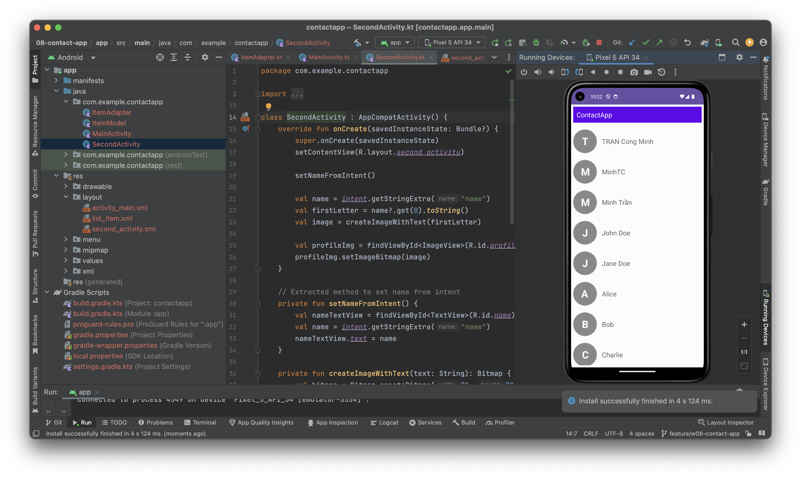
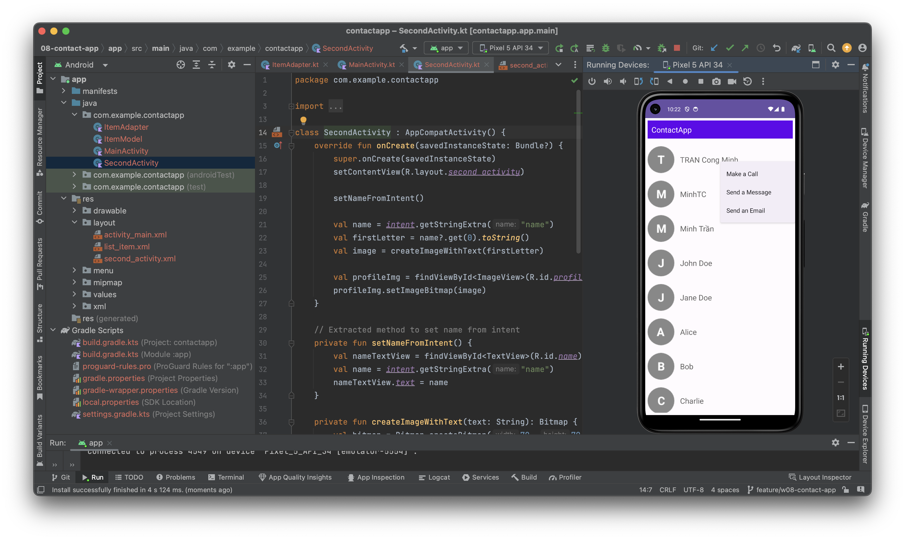
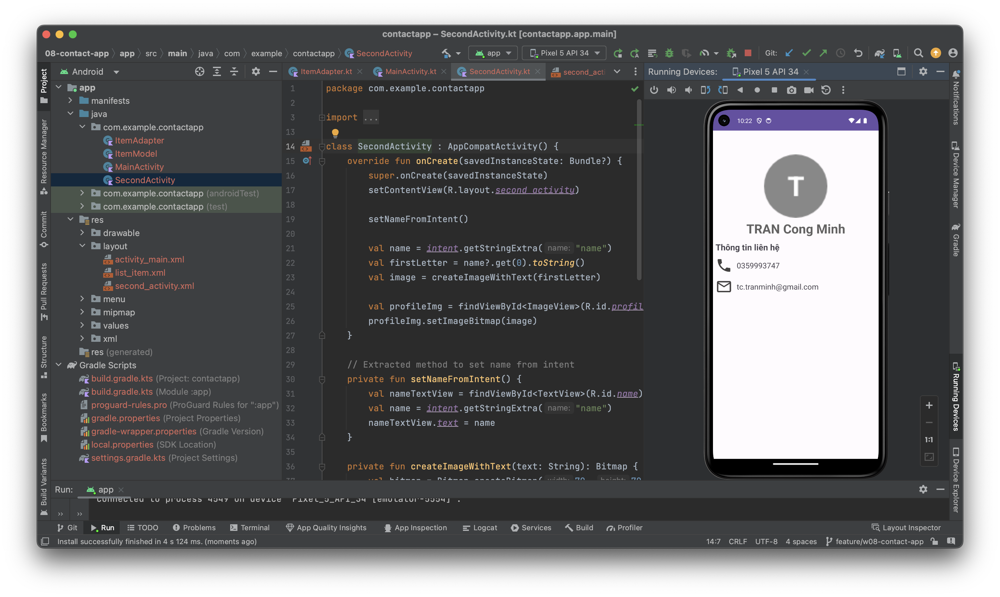
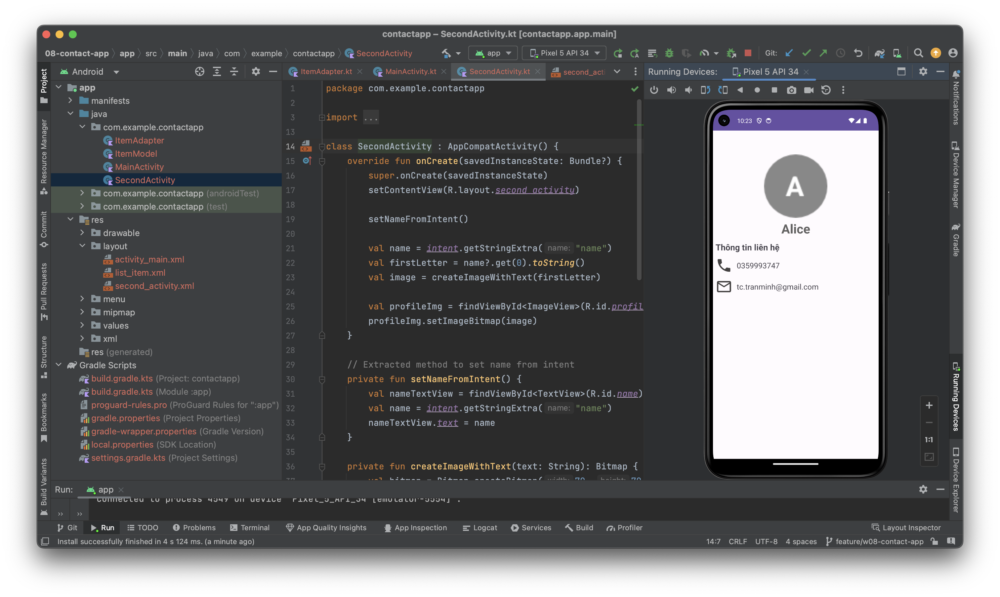

# Contact App

Developed by MinhTC

This application serves as a contact directory with the following features:

- The main screen displays a list of contacts. Each contact includes information such as ID, Full Name, Phone Number, and Email. Only the Full Name is displayed in the list.
- Clicking on a contact opens a screen that displays detailed information.
- Context menu: Long pressing on a contact opens a menu that allows you to call, send an SMS, or send an email.

# DEMO

