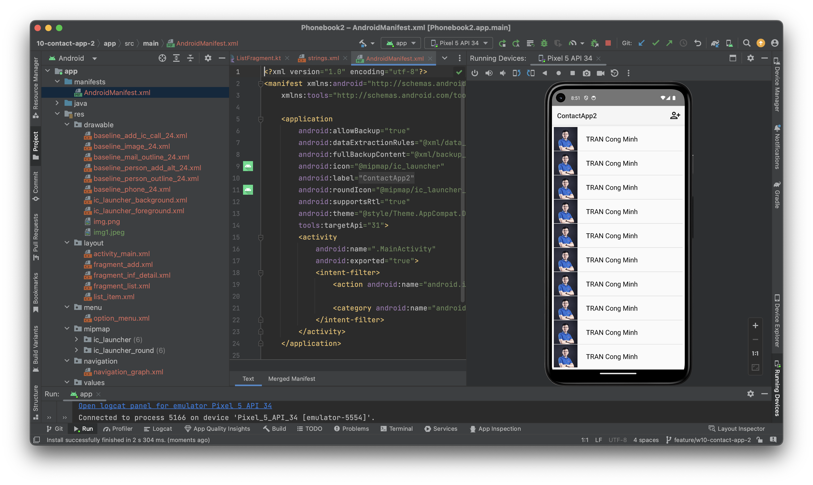

# Contact App

Developed by MinhTC

This application serves as a contact directory with the following features:

- Use fragments to perform functions instead of activities
- A fragment displays the list
- Create an option menu to add a directory, use a fragment to create an interface to add a directory
- When clicking on an object in the list, open the screen to display detailed directory, also use a fragment to perform this detailed screen.

# DEMO

# 